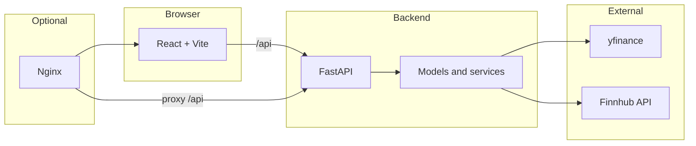

<div align="center">

# Quantara

### AI-driven trading analytics — one screen for price, forecast, sentiment, and backtests

[](https://react.dev/)
[](https://fastapi.tiangolo.com/)
[](https://www.python.org/)
[]()

</div>

**Quantara** is a full-stack trading intelligence dashboard. Choose a ticker and get **OHLCV charting**, a **machine-learned next-day directional forecast** with confidence, a **rolling news-sentiment series**, **strategy backtests** with an equity curve and risk metrics, and a **live headlines feed** with per-article sentiment — coordinated through a single FastAPI backend and a React + Vite frontend.

The first visit can show a **static demo snapshot** (no API required for the initial paint); after you pick a symbol from the search, the app loads **live data** from the backend.

---

## Highlights

| | |
|:---|:---|
| **Unified view** | Market structure, model output, sentiment, and historical simulation in one layout |
| **Real data path** | Yahoo Finance–style prices via `yfinance`, headlines and metadata via **Finnhub** |
| **ML pipeline** | Feature engineering, ensemble-style forecasting (e.g. XGBoost / CatBoost family), backtesting services |
| **Production-shaped ops** | **Docker Compose** for local full stack, **Kubernetes** manifests for cluster deploys, Nginx fronting the SPA |

---

## Screenshots

<p align="center">
  <b>Full dashboard</b><br/>
  
</p>

<p align="center">
  <i>End-to-end view: charting, controls, forecast, and sentiment context.</i>
</p>

<table>
  <tr>
    <td width="50%" align="center">
      <b>Chart · forecast · signal</b><br/><br/>
      
      <p><i>Candlesticks with forecast panel and sentiment trend.</i></p>
    </td>
    <td width="50%" align="center">
      <b>Backtest · headlines</b><br/><br/>
      
      <p><i>Backtest KPIs, equity curve, and scored news feed.</i></p>
    </td>
  </tr>
</table>

---

## What it does

- **Interactive candlestick chart** — OHLCV with optional volume, SMA overlays, and timeframes from **1D** through **1Y**
- **Forecast panel** — Next-session direction (**bullish / bearish**), **confidence band**, and **expected move** (model-driven)
- **Sentiment** — ~30-day daily sentiment series derived from headline-level scoring
- **Backtesting** — Cumulative P&amp;L, Sharpe, max drawdown, CAGR, trade activity, and **equity curve** with range tabs
- **Headlines** — Recent articles with **sentiment scores** for quick context
- **Ticker search** — Autocomplete over the tracked universe once `/api/tickers` is available

---

## Architecture (at a glance)



- **Frontend** talks to **`/api`** (dev proxy to Uvicorn, or Nginx → backend in Docker/K8s).
- **Backend** aggregates OHLCV, runs inference and backtests, normalizes news and sentiment for the UI contract.

---

## Tech stack

| Layer | Technologies |
|--------|----------------|
| **UI** | React 18, Vite, Recharts, Axios |
| **API** | Python 3.10+, FastAPI, Uvicorn |
| **ML / analytics** | scikit-learn ecosystem, XGBoost, CatBoost, custom feature and backtest services |
| **Data** | `yfinance`, Finnhub REST |
| **Packaging** | Docker, Docker Compose; Nginx for static + reverse proxy; Kubernetes manifests under `k8s/` |

---

## Repository layout

```
Quantara/
├── backend/
│   ├── app.py                 # FastAPI routes, CORS, API contract
│   ├── models/                # Training, evaluation, feature pipeline
│   ├── services/              # Prediction, yfinance, Finnhub, backtesting
│   ├── utils/
│   ├── Dockerfile
│   └── requirements.txt
├── frontend/
│   ├── src/
│   │   ├── App.jsx
│   │   ├── data/              # Demo snapshot data (optional first load)
│   │   └── components/
│   ├── nginx.conf
│   ├── Dockerfile
│   └── package.json
├── k8s/                       # Namespace, deployments, services, ingress, secrets
├── docker-compose.yml
├── examples/                  # README screenshots (see above)
└── README.md
```

---

## Getting started

### Prerequisites

- **Python 3.10+**
- **Node.js 18+**
- A **[Finnhub](https://finnhub.io/register) API key** (for live news and related endpoints)

### Backend (from repo root)

```bash
python -m venv .venv
# Windows
.venv\Scripts\activate
# macOS / Linux
# source .venv/bin/activate

pip install -r backend/requirements.txt
```

Create `backend/.env` (or a `.env` at repo root if you rely on the loader in `app.py`):

```env
FINNHUB_API_KEY=your_key_here
```

```bash
uvicorn backend.app:app --reload
```

API default: **http://127.0.0.1:8000**

### Frontend

```bash
cd frontend
npm install
npm run dev
```

App default: **http://localhost:5173** (Vite proxies `/api` to the backend in dev — see `vite.config.js`).

---

## Docker Compose

```bash
docker-compose up --build
```

- **API:** http://localhost:8000  
- **UI:** http://localhost:80 (Nginx serves the SPA and proxies `/api` to the backend)

```bash
docker-compose down
```

---

## Kubernetes

Manifests live in `k8s/`. Typical flow:

```bash
kubectl apply -f k8s/namespace.yaml

kubectl create secret generic quantara-secrets \
  --namespace=quantara \
  --from-literal=FINNHUB_API_KEY=your_key_here

docker build -t quantara-backend:latest ./backend
docker build -t quantara-frontend:latest ./frontend

kubectl apply -f k8s/backend.yaml
kubectl apply -f k8s/frontend.yaml
# Optional: kubectl apply -f k8s/ingress.yaml
```

Backend is exposed inside the cluster as **ClusterIP**; frontend is wired for external access per your manifest (e.g. **LoadBalancer** on port 80). Adjust image names and registry for your environment.

---

## API reference

| Method | Path | Description |
|--------|------|-------------|
| `GET` | `/api/tickers` | Tracked ticker universe |
| `GET` | `/api/prediction/{ticker}` | OHLCV, forecast, sentiment series, headlines |
| `GET` | `/api/backtest/{ticker}` | Backtest metrics and equity curve |
| `GET` | `/api/ohlcv/{ticker}?days=180` | Raw OHLCV |
| `GET` | `/api/news/{ticker}?days=7` | Company news |
| `GET` | `/api/sentiment/{ticker}?days=30` | Daily sentiment series |
| `GET` | `/api/doctor?ticker=AAPL` | Diagnostics and contract checks |

---

## Roadmap

**Delivered in v1**

- [x] Candlestick + volume, timeframes, SMA overlays  
- [x] ML directional forecast with confidence and expected move  
- [x] Finnhub news + headline sentiment and rolling sentiment chart  
- [x] Backtest KPIs, equity curve, and headlines panel  
- [x] Ticker search  
- [x] Docker / Compose and Kubernetes manifests  

**Ideas for later**

- [ ] FinBERT-class transformer sentiment  
- [ ] Multi-ticker / portfolio view  

---

## License

This project is for **educational and research** purposes. Not financial advice.

---

## Author

**Deep Sahu** — [LinkedIn](https://linkedin.com/in/deepsahu1) · [Portfolio](https://deepsahu.vercel.app) · [GitHub](https://github.com/deepsahu21)
